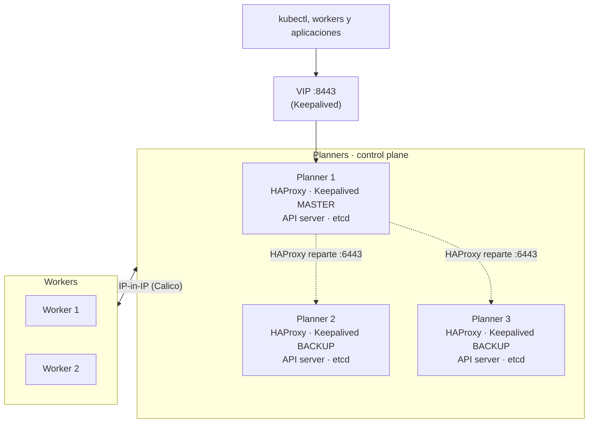

# Cluster Kubernetes HA en AlmaLinux 9

Guía para montar un cluster Kubernetes de alta disponibilidad con **3 planners** (nodos de control plane, también llamados masters) y **2 workers** sobre AlmaLinux 9, usando kubeadm, containerd, Calico, HAProxy y Keepalived.

Este README explica la arquitectura y qué hace cada paso. **Los comandos están en la carpeta de cada nodo.**

## Cómo usar este repositorio

```text
.
├── README.md                  # esta explicación
├── planner-1/README.md        # comandos del primer planner (crea el cluster)
├── planner-2-y-3/README.md    # comandos del segundo y tercer planner
├── worker-1-y-2/README.md     # comandos de los workers
└── scripts/
    ├── check-k8s.sh           # comprueba el estado del nodo
    └── limpiar-nodo.sh        # borra una instalación anterior
```

1. Clona el repositorio en cada nodo.
2. Entra en la carpeta que corresponde a ese nodo y sigue su `README.md` de arriba abajo.
3. Respeta el orden entre nodos:

| Orden | Nodo | Carpeta |
| --- | --- | --- |
| 1 | Planner 1 (pasos 1 a 7) | [`planner-1`](planner-1/README.md) |
| 2 | Planner 2 | [`planner-2-y-3`](planner-2-y-3/README.md) |
| 3 | Planner 3 | [`planner-2-y-3`](planner-2-y-3/README.md) |
| 4 | Worker 1 y worker 2 | [`worker-1-y-2`](worker-1-y-2/README.md) |
| 5 | Planner 1 (pasos 11 a 14: etiquetas, taint, pruebas) | [`planner-1`](planner-1/README.md) |

Cada guía empieza con un **Paso 0**: un bloque de valores (IPs, nombres, versiones) que se pega en la terminal. Todos los comandos posteriores usan esos valores, así que solo hay que cambiarlos una vez. Los valores de red y versiones deben ser **idénticos en todos los nodos**.

## Arquitectura



- Toda petición a la API de Kubernetes va a una **IP virtual (VIP)**. No es un servidor: Keepalived la asigna al planner con mayor prioridad que tenga HAProxy funcionando, y la mueve a otro en uno o dos segundos si ese planner cae.
- El **HAProxy** del planner que tiene la VIP escucha en el puerto `8443` y reparte las peticiones entre los API servers de los 3 planners (puerto `6443`). Usa el 8443 porque el 6443 lo ocupa el API server local.
- **etcd**, la base de datos del cluster, está replicado en los 3 planners.
- El tráfico entre pods **no** pasa por la VIP: va directo de nodo a nodo por el túnel de Calico.
- Planners y workers pueden estar en redes distintas si hay enrutamiento directo entre ellas (sin NAT) y el router deja pasar el **protocolo IP 4** (IP-in-IP).

### Requisitos

- 5 servidores con AlmaLinux 9: 2 CPU y 2 GB de RAM como mínimo (4 GB en los planners).
- Hostname, `machine-id` y dirección MAC distintos en cada nodo (cuidado con las VMs clonadas).
- Una IP libre para la VIP en la red de los planners, fuera del rango DHCP.
- Conectividad entre todos los nodos en los puertos de la sección [Firewall](#firewall).

### Versiones probadas

| Componente | Versión |
| --- | --- |
| AlmaLinux | 9 |
| Kubernetes (kubeadm, kubelet, kubectl) | 1.34.12 |
| containerd | 2.3.5 |
| Calico | v3.30.0 |

La versión de Kubernetes y la de containerd deben ser **exactamente iguales** en todos los nodos.

### Rangos de red por defecto

| Uso | Valor |
| --- | --- |
| Pods | `10.244.0.0/16` |
| Servicios | `10.96.0.0/12` |
| DNS del cluster | `10.96.0.10` |
| NodePort | `30000-32767/tcp` |

El rango de pods no puede solaparse con ninguna red real. El valor por defecto de Calico (`192.168.0.0/16`) choca con muchas redes de oficina; por eso se cambia a `10.244.0.0/16`.

## Conceptos

| Componente | Qué es | Dónde corre |
| --- | --- | --- |
| kube-apiserver | La API de Kubernetes: punto de entrada para kubectl y para todos los componentes | Planners (6443) |
| etcd | Base de datos replicada con todo el estado del cluster | Planners (2379-2380) |
| kube-scheduler | Elige en qué nodo se ejecuta cada pod | Planners |
| kube-controller-manager | Mantiene el estado real igual al deseado (réplicas, nodos) | Planners |
| kubelet | Agente que arranca y vigila los contenedores de su nodo | Todos (10250) |
| kube-proxy | Programa las reglas de red de los Services y NodePorts | Todos |
| containerd | Runtime que descarga imágenes y ejecuta contenedores | Todos |
| Calico | Red de pods: da IP a cada pod y comunica pods entre nodos | Todos |
| CoreDNS | DNS interno de servicios | Pods en `kube-system` |
| Keepalived | Decide qué planner tiene la VIP | Planners |
| HAProxy | Balancea la API entre los 3 planners | Planners (8443) |
| kubeadm | Crea el cluster (`init`) y une nodos (`join`) | Todos |
| Taint | Marca que impide ejecutar aplicaciones en un nodo | Planners |

### etcd: quórum, líder y learner

- **Quórum:** etcd confirma una escritura cuando la guarda la mayoría. Con 3 miembros tolera la caída de 1; con 2, la caída de cualquiera detiene el cluster. Por eso no conviene quedarse mucho tiempo con solo 2 planners, y los planners se reinician **de uno en uno**.
- **Líder:** un miembro coordina las escrituras. Si cae, los demás eligen otro en menos de un segundo. No tiene relación con qué planner tiene la VIP.
- **Learner:** miembro nuevo que se sincroniza sin votar. En un cluster sano, todos muestran `IS LEARNER = false`.

## Qué hace cada paso

### Preparación del sistema (paso 1, todos los nodos)

| Paso | Objetivo | Por qué |
| --- | --- | --- |
| 1.1 Clave GPG y actualización | Que `dnf` pueda verificar paquetes y el sistema esté al día | Sin la clave de AlmaLinux (cambió en 2024), `dnf update` falla |
| 1.2 Hostname y /etc/hosts | Nombre único por nodo y resolución entre todos | Kubernetes usa el hostname como nombre del nodo |
| 1.3 Swap | Desactivarla de forma permanente | kubelet no arranca con swap activa |
| 1.4 SELinux | Modo permisivo | En *enforcing* bloquea a kubeadm y a HAProxy |
| 1.5 Módulos y sysctl | Cargar `overlay` y `br_netfilter`, activar `ip_forward` | containerd usa `overlay`; la red de Kubernetes necesita los otros dos |
| 1.6 NetworkManager | Que ignore las interfaces de Calico | Si las gestiona, cambia sus rutas y los pods pierden red |
| 1.7 containerd | Runtime con CRI activo y cgroups de systemd | El `config.toml` del paquete desactiva CRI; kubelet y containerd deben usar el mismo gestor de cgroups |
| 1.8 kubeadm, kubelet, kubectl | Misma versión exacta en todos los nodos | La línea `exclude` del repo evita actualizaciones accidentales con `dnf update` |

Es normal que kubelet se reinicie en bucle hasta el `init` o el `join`.

### Firewall

Todos los nodos usan firewalld. Además de los puertos, las redes de pods y de servicios se añaden a la zona `trusted`: sin eso, firewalld rechaza el tráfico entre pods de nodos distintos.

| Puerto / protocolo | Uso | Planners | Workers |
| --- | --- | :---: | :---: |
| 6443/tcp | API server | ✅ | |
| 8443/tcp | HAProxy (entrada por la VIP) | ✅ | |
| 2379-2380/tcp | etcd | ✅ | |
| 10250/tcp | kubelet | ✅ | ✅ |
| 10256/tcp | kube-proxy | ✅ | ✅ |
| 10257/tcp, 10259/tcp | controller-manager y scheduler | ✅ | |
| 179/tcp | BGP de Calico | ✅ | ✅ |
| 30000-32767/tcp | NodePort | ✅ | ✅ |
| VRRP | Keepalived | ✅ | |
| Protocolo 4 | Túnel IP-in-IP de Calico | ✅ | ✅ |

### HAProxy y Keepalived (solo planners)

HAProxy tiene la misma configuración en los 3 planners. Se activa el booleano de SELinux `haproxy_connect_any` para que HAProxy pueda conectar al puerto 6443 aunque SELinux vuelva a *enforcing*.

Keepalived solo cambia dos valores entre planners:

| Planner | Estado | Prioridad |
| --- | --- | --- |
| 1 | MASTER | 101 |
| 2 | BACKUP | 100 |
| 3 | BACKUP | 99 |

`virtual_router_id`, la contraseña (`auth_pass`, máximo 8 caracteres) y la VIP deben coincidir en los 3. Keepalived vigila que HAProxy siga vivo: si se cae, ese planner cede la VIP.

Hasta que cada planner se une al cluster, HAProxy lo marca `DOWN` con `Connection refused`. Es lo esperado.

### Crear el cluster (planner 1)

`kubeadm init` genera los certificados y arranca etcd, API server, scheduler y controller-manager en el planner 1.

| Opción | Para qué |
| --- | --- |
| `--control-plane-endpoint` | Todos los nodos hablan con la API a través de la VIP, no de un planner concreto. Es lo que hace el cluster HA. |
| `--upload-certs` | Sube cifrados los certificados para que los otros planners los descarguen al unirse |
| `--pod-network-cidr` | Rango de IPs de los pods; debe coincidir con el de Calico |
| `--apiserver-advertise-address` | IP real del planner donde escucha su API server |

Después se instala **Calico** con el mismo rango de pods. Hasta entonces el nodo aparece `NotReady` y CoreDNS en `Pending`.

El fichero `~/kubeadm-init.log` contiene tokens de acceso al cluster: no lo subas a ningún repositorio.

### Unir los planners 2 y 3

El comando de unión se genera en el planner 1 y se ejecuta en el planner nuevo con `--control-plane`. El `certificate-key` caduca a las **2 horas** y el token a las 24, por eso se genera uno nuevo para cada planner.

Al unirse, el planner nuevo añade su API server, scheduler, controller-manager y un miembro de etcd.

### Unir los workers

Los workers usan un join normal, sin `--control-plane`. No llevan HAProxy, Keepalived ni `admin.conf`, así que no tienen kubectl de administrador, por seguridad. Solo ejecutan kubelet, kube-proxy, calico-node y las aplicaciones.

### Taint de los planners

kubeadm pone en los planners el taint `node-role.kubernetes.io/control-plane:NoSchedule`, que impide ejecutar aplicaciones en ellos. Mientras no haya workers, se puede quitar para que los planners ejecuten aplicaciones. Con los workers listos, se vuelve a poner.

`NoSchedule` no mueve los pods que ya están en marcha: para moverlos a los workers, se recrean con `kubectl rollout restart`. calico-node, kube-proxy y CoreDNS toleran el taint y siguen en los planners.

### Pruebas

- **Red entre pods:** un pod en un worker hace ping a un pod en un planner, y al revés. Confirma que el túnel de Calico funciona entre nodos, también entre redes distintas. El DNS del cluster debe resolver `kubernetes.default.svc.cluster.local`.
- **Failover de la API:** se reinicia el planner 1 y, desde el planner 2, se comprueba que la VIP pasa a él y que `kubectl get nodes` sigue respondiendo. Cuando el planner 1 vuelve, recupera la VIP porque tiene la prioridad más alta. Solo se reinicia un planner a la vez.

### Script de comprobación

`scripts/check-k8s.sh` revisa el estado del nodo local y marca cada punto como OK o FALTA:

```bash
sudo ./scripts/check-k8s.sh master <VIP>
sudo ./scripts/check-k8s.sh worker <VIP>
```

Se ejecuta siempre con `sudo`: sin él, las comprobaciones de firewall fallan aunque las reglas existan.

## Problemas frecuentes

| Síntoma | Causa | Solución |
| --- | --- | --- |
| `dnf update` pide ejecutar `rpm --import public.gpg.key` | Falta la clave GPG de AlmaLinux | Paso 1.1 |
| Error 404 en `.../centos/docker-/repodata/repomd.xml` | La URL del repo de Docker se cortó al pegarla | `sudo rm -f /etc/yum.repos.d/download.docker.com*`, `sudo dnf clean all` y repetir con la URL completa |
| `esperando el bloqueo ... /var/lib/rpm/.rpm.lock` | Otro `dnf` en curso, normalmente el `dnf update` | Esperar a que termine; no borrar el lock ni usar `kill -9` |
| `crictl: command not found` | kubeadm ya no instala `cri-tools` como dependencia | `sudo dnf install -y cri-tools --disableexcludes=kubernetes` |
| HAProxy: `Permission denied at initial connection step` | SELinux en *enforcing* | `sudo setenforce 0` y `sudo setsebool -P haproxy_connect_any 1` |
| NodePort: `No route to host` | El Service aún no tiene pods listos | Esperar a que los pods estén en `Running` |
| Ping entre pods de nodos distintos con 100% de pérdida | firewalld rechaza el tráfico de pods | Añadir las redes de pods y servicios a la zona `trusted` |
| `calico-node` se queda en `0/1` en un nodo | BGP (179/tcp) o protocolo 4 bloqueado entre redes | Abrirlos en el router, o cambiar Calico a VXLAN (4789/udp) |
| `kubeadm join` falla por certificados | `certificate-key` caducado | Regenerarlo en el planner 1 |
| Un join de planner falla a medias | Quedó un miembro de etcd a medio registrar | En el planner 1, `etcdctl member list` y `member remove <id>`; en el nodo, `sudo kubeadm reset -f` |
| Hostname o `machine-id` repetidos | VMs clonadas | `hostnamectl set-hostname` y `rm -f /etc/machine-id && systemd-machine-id-setup` |
| El servidor tiene `cni0`, `flannel.1` o `docker0` | Restos de otro cluster | `sudo ./scripts/limpiar-nodo.sh` y reiniciar |

Tras cualquier cambio de SELinux o de firewall, comprueba el estado real (`getenforce`, `firewall-cmd --list-all`) en lugar de darlo por hecho.

## Operación

### kubectl desde tu PC

1. Instala kubectl con la misma versión menor que el cluster.
2. Copia `~/.kube/config` del planner 1 a tu PC (`scp`).
3. Comprueba con `kubectl cluster-info`: debe mostrar la VIP.

Ese fichero ya apunta a la VIP, así que funciona aunque caiga un planner. Da acceso de administrador total: no lo subas a repositorios ni lo compartas. Para otras personas, crea usuarios con RBAC.

### Qué se hace desde dónde

| Desde el PC (kubectl) | Por SSH en los nodos |
| --- | --- |
| Desplegar, escalar y borrar aplicaciones | Unir o quitar nodos |
| Logs, `exec`, `port-forward` | `kubeadm upgrade` |
| ConfigMaps, Secrets, namespaces, RBAC | `kubeadm certs renew` |
| Taints, etiquetas, `cordon`, `drain` | Backups de etcd |
| Instalar componentes con Helm | HAProxy, Keepalived, firewall, SELinux |
| | `journalctl -u kubelet` y diagnóstico de un nodo `NotReady` |

### Mantenimiento de un nodo

1. `kubectl drain <nodo> --ignore-daemonsets --delete-emptydir-data`
2. Por SSH: actualizar, reiniciar, etc.
3. `kubectl uncordon <nodo>`

En los planners, de uno en uno y esperando a que el anterior vuelva a `Ready`.

### Certificados

Los certificados del cluster caducan a los **12 meses** del `init`. Si se pasa la fecha, el cluster deja de funcionar. Revísalos con `sudo kubeadm certs check-expiration` en un planner y deja un recordatorio.

## Mejoras recomendadas

- [ ] **Backups de etcd** automáticos (`etcdctl snapshot save`), guardados fuera del cluster.
- [ ] **Almacenamiento persistente:** el cluster no trae StorageClass. Para pruebas, local-path-provisioner; para producción, NFS o Longhorn.
- [ ] **`preempt_delay` en Keepalived** (con `state BACKUP` en los 3 planners), para que el planner 1 no recupere la VIP antes de estar listo tras un reinicio.
- [ ] **Ingress y MetalLB**, para publicar aplicaciones por dominio en lugar de NodePorts.
- [ ] **Usuarios con RBAC**, en lugar de repartir `admin.conf`.

## Limpiar un nodo

`scripts/limpiar-nodo.sh` elimina Kubernetes, containerd, Docker, HAProxy y Keepalived, con todos sus contenedores y datos locales. Pide escribir `BORRAR` para confirmar. Si el nodo pertenece al cluster, sácalo antes con `kubectl delete node <nombre>` desde un planner.

```bash
sudo ./scripts/limpiar-nodo.sh
sudo reboot
```
